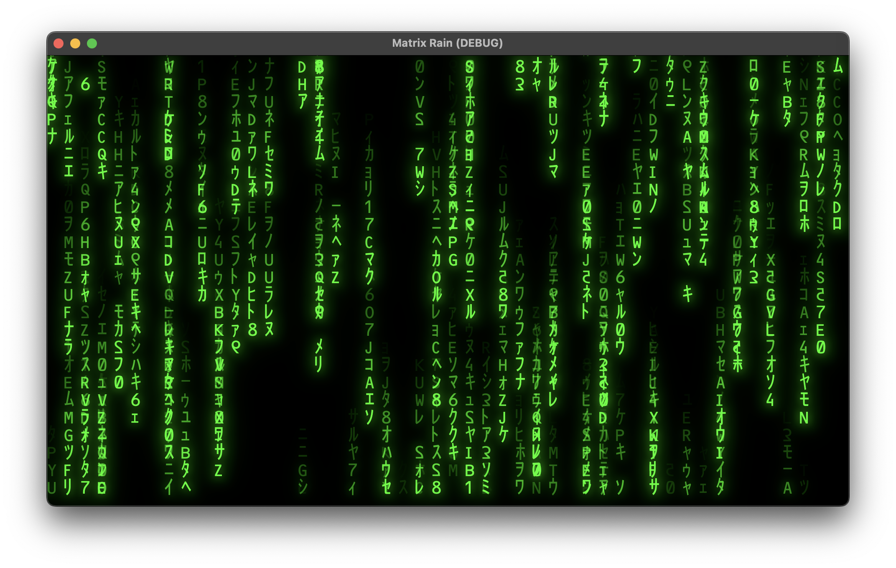

## Matrix Rain Demo

This is just a simple implementation of the 'Matrix Rain' screensaver using the Godot 4 game engine. (I'm just learning this engine, so if anyone comes across this and has suggestions for improvements I'd be happy to hear them).

The font is [Matrix Code NFI](https://fontmeme.com/fonts/matrix-code-nfi-font/) which is available for demo purposes.

I've set the default window size to 1920x1080. I think the default font size (48) and `RainColumn` decay rates produce an appropriate 'denseness' of rain. Ideally, if the window is made larger, the density should be adjusted dynamically. Right now the rain becomes too sparse.